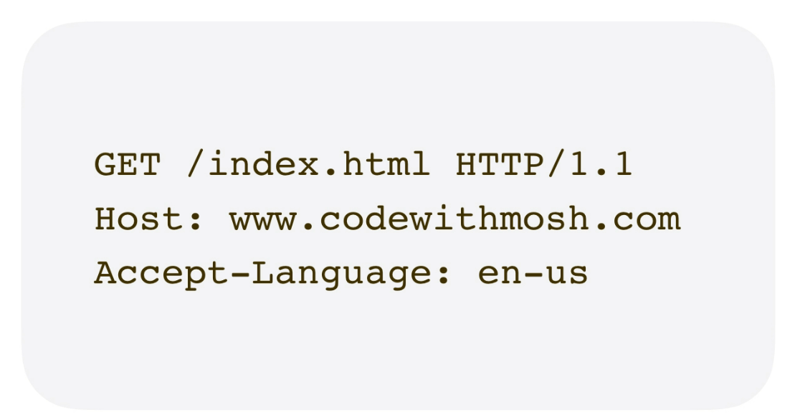
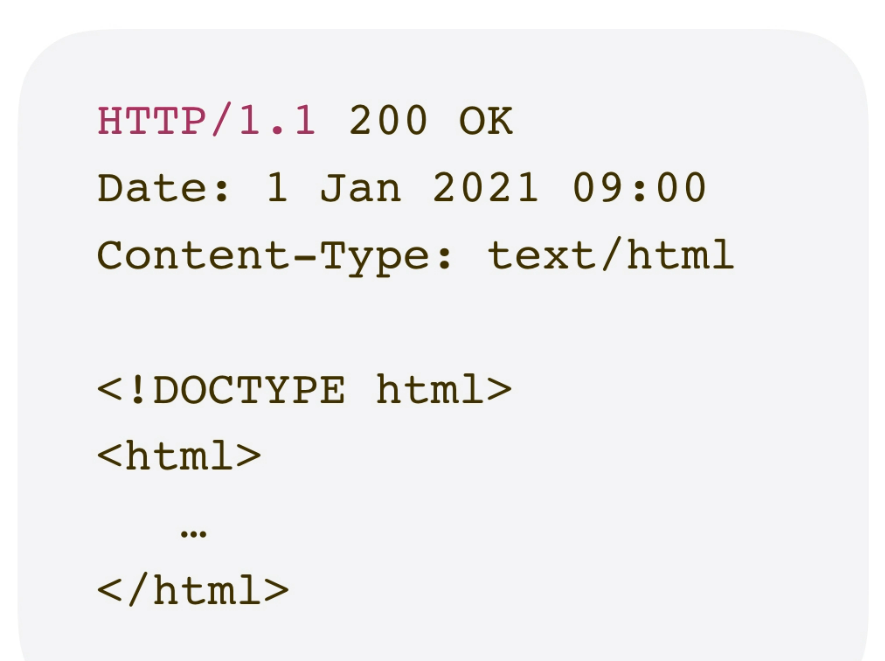

# Language and Tools of Web Development

HTML (HyperText Markup Language)

- Defines the structure and content of a web page

- It's a markup language, not a programming language

- Think of it as the building blocks of your website

CSS (Cascading Style Sheets)

- Used to style the web page (colors, layout, fonts, etc.)

- It's all about the visual appearance and design

- CSS is a styling language

JavaScript

- Adds interactivity and functionality to the web page

- It’s a programming language

- Enables features like form validation, animations, and dynamic content

# How the Web Works

When you type a URL (web address) into your browser and press Enter, you’re telling the browser to request a specific resource from the internet. A **URL** (Uniform Resource Locator) helps locate that resource, which could be a web page (HTML document), an image, a video file, a font, or any other type of file.

Once the URL is entered, two main parts get involved in the process — the **client** and the **server**. Your **browser** acts as the client, which sends a request. The server, usually a powerful computer somewhere on the internet, receives that request and responds with the resource you asked for.

This exchange of information between client and server happens using a protocol called **HTTP** (HyperText Transfer Protocol). HTTP is a simple, text-based communication system that tells the client and server how to format and send messages. It's not a programming language — just a set of rules both sides follow to "talk" to each other. There’s also **HTTPS**, which is the secure version of HTTP. It encrypts the communication between the browser and the server so that no one else can see or tamper with the data being exchanged. This is especially important when you're entering sensitive information, like passwords or credit card numbers.

- In the first line of the HTTP request, the browser is asking for a file called `index.html` using **HTTP version 1.1**.

- The second line specifies the **host**, for example: `codewithmosh.com`.

- The third line tells the server which **languages** the client (browser) can accept in the response.

So, this message is structured according to the **HTTP protocol**, which both the client and server understand and follow.

When the **server receives** this message, it figures out what the client is asking for — usually a specific file or data — and then sends it back to the client.

The first message sent by the client is called an **HTTP Request**. The response from the server is called an **HTTP Response**.

In the **HTTP response** from the server:

- The **first line** shows the HTTP version followed by a **status code** (e.g., `200 OK`), which tells whether the request was successful.

- Then, the response includes metadata such as the **date** and the **type of content** being sent (like `text/html` for HTML files).

- After these headers, the server sends the actual **HTML code** of the requested web page.

As the **browser reads the HTML document**, it builds what’s called the **DOM (Document Object Model)**. The DOM is a tree-like structure that represents all the elements and content in the HTML document — essentially turning the HTML into objects the browser can work with.

While reading the HTML, the browser also finds references to external resources such as images, fonts, CSS, and JavaScript files.
Each of these resources has its own URL (address). For each of these resources, the browser sends a separate HTTP request to the server to fetch them. Most of these requests are sent in parallel, so the web page can load as quickly as possible.

Once the browser has received all the necessary resources, it will **render** the HTML document — that means it displays the final webpage to the user.

---

127.0.0.1 - Represents the local computer

5500 - Port number on which our web server is listening

---

p class - Here class means classification

---

We can validate our Html and CSS files
