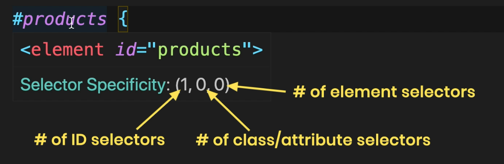

# Providing CSS

We can apply CSS in three main ways:

#### 1. Embedded Style Sheet

CSS rules are written within a `<style>` tag inside the `<head>` section of an HTML document.

Drawbacks:

- It is not easily scalable for large projects.

- It violates the software engineering principle of **Separation of Concerns**, as it mixes content (HTML) with styling (CSS).

#### 2. External Style Sheet

CSS is written in a separate `.css` file and linked to the HTML document using a `<link>` tag.

Advantages:

- It is the most preferred method.

- It allows for better scalability, reusability, and separation of concerns.

#### 3. Inline Styles

CSS is applied directly to an HTML element using the `style` attribute.

Drawbacks:

- Should generally be avoided because it mixes content with presentation.

- It makes the code harder to maintain.

**Note**: While inline and embedded styles are not ideal for large-scale projects, they can still be useful in specific situations, such as quick testing, dynamic styling via JavaScript, or when applying a unique style to a single element.

# Normalizing CSS

Different browsers often render some HTML elements in slightly different ways. This can lead to inconsistencies in the appearance of a website across browsers.

To address this issue, we can use `Normalize.css`. It provides a consistent baseline by making built-in browser styles more uniform, so websites look the same across all major browsers.

**Note:** Normalize.css should be linked before your main style sheet, so your custom styles are applied on top of the normalized base.

# Basic Selectors

In CSS, there are several ways to select HTML elements for styling purposes:

1. Type Selector
2. ID Selector
3. Class Selector
4. Attribute Selector

### 1. Type Selector

Selects elements by their tag name.

```css
p {
  color: blue;
}
```

This will style all `<p>` elements with blue text

### 2. ID Selector

Selects an element by its unique `id`.

```css
#product {
  color: red;
}
```

Only the element with `id="product"` will be styled

### 3. Class Selector

Selects all elements with a specific class.

```css
.product {
  color: red;
}
```

All elements with `class="product"` will be styled.

The difference between **ID** and **class** attributes is that you can have multiple elements with the same class, but you cannot have multiple elements with the same ID—an ID must be unique within a page.

### 4. Attribute Selector

You can select elements based on their attributes

```HTML
<body>
    <a href="https://google.com" target="_blank">Google</a>
</body>
```

#### a. Select elements with a specific attribute

```css
a[target] {
  color: red;
}
```

This selects all `<a>` elements that have a target attribute, regardless of its value.

#### b. Select elements with a specific attribute value

```css
a[target="_blank"] {
  color: red;
}
```

This targets only `<a>` elements with `target="_blank"`.

#### c. Partial attribute match

```css
a[href*="google"] {
  color: red;
}
```

This selects any `<a>` element where the `href` contains the word "google".

# Relational Selectors

We can also select elements based on their **relationship with other elements**. These are also called combinator selectors, and they allow us to style elements depending on how they are positioned relative to other elements in the HTML structure.

```html
<body>
  <section id="products">
    <p>Lorem, ipsum dolor sit amet consectetur adipisicing elit.</p>
    <article>
      <p>Lorem ipsum dolor sit, amet consectetur adipisicing.</p>
    </article>
  </section>
  <p>Lorem ipsum dolor sit amet consectetur, adipisicing elit. Labore.</p>
  <p>Lorem ipsum dolor sit amet consectetur adipisicing elit. Numquam</p>
</body>
```

### 1. Descendent Selector

```css
#products p {
  color: orange;
}
```

This selects **all** `<p>` **elements** that are **inside** the element with the ID `products`, at any depth.

### 2. Direct Child Selector

```css
#products > p {
  color: orange;
}
```

This selects **only the** `<p>` **elements** that are **direct children** of the `#products` element.

### 3. Adjacent Sibling Selector

```css
#products + p {
  color: orange;
}
```

This selects the **first** `<p>` **element immediately after** the `#products` element.

### 4. General Sibling Selector

```css
#products ` p {
  color: orange;
}
```

This selects **all** `<p>` **elements that are siblings** of the `#products` element and appear **after** it.

### Advantages

- **Cleaner HTML**: You don't have to add extra `id` or `class` attributes to every element.

- **Flexible Styling**: Allows targeting based on structure rather than naming.

### Disadvantages

- **Fragile**: These selectors depend on the **DOM structure**. If you move elements around, your styles may break.

- **Performance**: They can be slightly **slower** than basic selectors because the browser starts **matching from right to left** and needs to validate the relationship.

# Pseudo-class Selector

Pseudo-classes are **not user-defined classes**. Instead, they are **predefined by the browser** and allow us to style elements based on their **state or position** in the DOM.

```html
<article>
  <h2>Heading</h2>
  <p>Lorem ipsum dolor, sit amet consectetur adipisicing.</p>
  <p>
    Lorem ipsum dolor sit amet consectetur adipisicing elit. Quis quibusdam quo
    consequuntur!
  </p>
</article>
```

```css
article :first-child {
  font-size: 140%;
  font-style: italic;
}
```

Selects the **first child of any element** inside the `article`.

```css
article :first-of-type {
  font-size: 140%;
  font-style: italic;
}
```

Selects the **first element of its type** inside its parent, regardless of position.

```css
article p:first-of-type {
  font-size: 140%;
  font-style: italic;
}
```

Selects the **first** `<p>` **element** inside the article.

```css
article p:first-child {
  font-size: 140%;
  font-style: italic;
}
```

Selects the `<p>` **only if it is the first child** of the `article`.

We also have the pseudo-classes `:last-child` and `:last-of-type`. These work similarly to `:first-child` and `:first-of-type`.

### Styling Elements Based on Position

```html
<article>
  <ul>
    <li>Item 1</li>
    <li>Item 2</li>
    <li>Item 3</li>
    <li>Item 4</li>
    <li>Item 5</li>
  </ul>
</article>
```

```css
ul li:nth-child(odd) {
  color: pink;
}
```

Applies the style to **odd-numbered** list items.

```css
ul li:nth-child(3n) {
  color: pink;
}
```

Applies the style to every **3rd item**.

### Pseudo-classes for Hyperlinks

```html
<a href="www.google.com">Google</a>
```

```css
a:visited {
  color: dodgerblue;
}
```

```css
a:link {
  color: dodgerblue;
}
```

```css
a:hover,
a:focus {
  color: pink;
}
```

The `:hover` pseudo-class applies when the user **moves the mouse pointer over an element**.

The `:focus` pseudo-class applies when the element **receives focus**, such as when the user **navigates using the `Tab` key or clicks on a form field**.

# Pseudo-element Selector

**Pseudo-classes** are used to style an element when it is in a **particular state**, such as when it is being **hovered** or has been **visited** (like a link).

On the other hand, **pseudo-elements** are used to style a **specific part** of an element, such as **the first letter**, **first line**, or content **before/after** an element.

```html
<p>
  Lorem ipsum dolor, sit amet consectetur adipisicing elit. Similique, nemo eos.
  Ipsam provident officia fugit animi corrupti deserunt, repudiandae dicta atque
  placeat commodi modi nostrum necessitatibus. Dolorum et beatae ad!
</p>
```

```css
p::first-letter {
  font-size: 140%;
  font-weight: bold;
}
```

This styles only the first letter of each `<p>` element.

```css
p::first-line {
  font-size: 140%;
  font-weight: bold;
}
```

This styles **only the first line** of text in a paragraph, based on the current width of the container.

```css
p::selection {
  background-color: pink;
}
```

This changes the background color of the** selected text** within a `<p>` element.

```css
::selection {
  background-color: pink;
}
```

This applies the same selection style **globally** to all elements on the page.

```css
p::before {
  content: "...";
}
```

This inserts the specified content (`"..."`) **before the content** of each `<p>` element.

# Selector Specifity

Sometimes, more than one CSS rule can target the same element, and these rules may have **conflicting styles**. This is where **CSS specificity** comes in—it determines **which rule takes priority**.

Each selector has a **weight**, based on the type of selector used:

- ID selector → 100

- Class, attribute, and pseudo-class selectors → 10

- Element (type) selectors → 1

If two rules target the same element, the one with the **higher specificity** will be applied. If two rules have the **same specificity**, the **last one written in the stylesheet** will be applied.

Note : In VS Code, when you hover over a CSS rule, you can **see the full selector** and understand which styles are being applied and overridden:



### Overriding with !important

If you need to **force a rule to apply**, regardless of specificity, you can use the **!important** declaration:

```css
p {
  color: red !important;
}
```

However, use `!important` only when necessary, as it makes styles harder to maintain and debug.

## Extra ->

```html
<section id="product">
  <p class="description">
    Lorem ipsum dolor sit amet consectetur adipisicing elit. Labore, eius?
  </p>
</section>
```

```css
#product .description {
}
```

selects a **descendant** with the `.description` class inside `#product`

```css
p.descriptor {
}
```

selects a `<p>` **element** with the `.descriptor` class on the **same element**

# Inheritance

#### Some CSS properties inherit from the parent.

```html
<p>Lorem ipsum <strong>dolor sit</strong> amet consectetur</p>
```

```css
p {
  color: blue;
}
```

`strong` also becomes blue because `color` is inherited.

#### To stop inheritance, use `**initial**`:

```css
strong {
  color: initial;
}
```

Now strong goes back to the default color.

#### Some properties don’t inherit, like `border`:

```css
p {
  border: 1px sold red;
}
```

Only the `p` tag gets a border. `strong` does not get another border inside.

#### To force inheritance, use `inherit`

```css
strong {
  border: inherit;
}
```

Now `strong` also gets another border style as its parent.

The styles related to **typography**, like `font`, `color`, `line-height`, `letter-spacing` are the ones that get inherited the most in CSS.

# Colors

In CSS, we can add colors using different formats like named colors, RGB, HSL, and Hexadecimal.

- RGB stands for Red, Green, Blue.

- RGBA is like RGB but with an added alpha channel for transparency.

- HSL stands for Hue, Saturation, and Lightness:

  - Hue is the color’s position on the color wheel (in degrees).

  - Saturation is the intensity or richness of the color.

  - Lightness controls how light or dark the color is.

- HSLA is the same as HSL but with an alpha channel for transparency.

# Gradients

With gradients, we can create a smooth transition between two or more colors. Gradients are actually treated as images in CSS. To add a gradient, we use the `background-image` or `background` property.

Some older browsers don’t support gradients, so it’s important to always provide a fallback solid background color before the gradient.

```css
div {
  background: red; /* fallback solid color */
  background: linear-gradient(
    to bottom right,
    dodgerblue,
    yellow
  ); /* gradient */
}
```

Here, the gradient is written second because if the browser supports gradients, it will use it. If not, it will fall back to the solid red color.

# Borders

We can set borders using the `border` property.

# Shadows

We can easily add shadows using the box-shadow property.

**Tip**: For a soft, natural shadow, place it directly under the element without shifting it too much to the side or bottom.

For text, we use the text-shadow property.

**Tip**: When adding a text shadow, use a semi-transparent color. This helps the shadow blend smoothly with the background.
