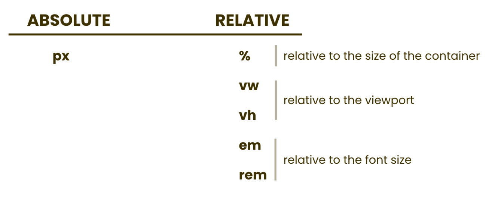
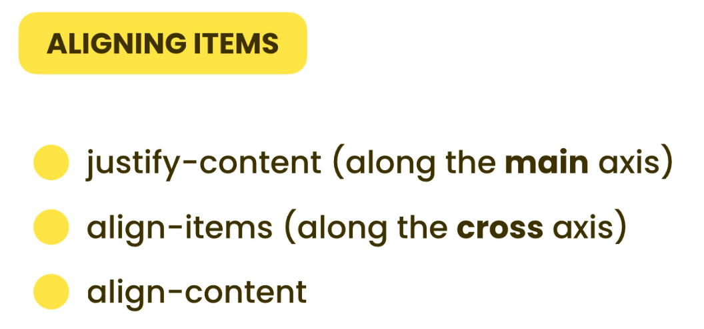

# The Box Model

Concept of Box Model - whenever browser renders an element, It puts that element inside an invisible box.


```html
<div>
  <p>Lorem ipsum dolor sit amet consectetur adipisicing elit.</p>
  <p>Lorem ipsum dolor sit amet consectetur adipisicing elit.</p>
</div>
```

If we apply `padding: 20px;` to each `<p>` element, the space between the two paragraphs becomes **40px** — because each paragraph adds 20px padding to its top and bottom, and they don't overlap. Padding adds space **inside** the element, between its content and its border.

However, if we apply `margin: 20px;` instead, the space between the two paragraphs remains **20px**, not 40px. This is due to a CSS behavior called **margin collapsing**. When **vertical margins** of two adjacent block elements meet, only the larger margin is used—they don't add up.

#### Summary:

- Use **padding** to add space between the content and the border of an element.

- Use **margin** to create space **between elements.**

- When **vertical margins** of two elements touch, **margin collapsing occurs**, and only the larger margin is applied. In contrast, **horizontal margins** (left and right) **do not collapse**. When two horizontal margins touch, they are **added together**.

# Sizing Elements

```css
.box {
  width: 100px;
  height: 100px;
}
```


```css
.box {
  width: 100px;
  height: 100px;
  padding: 20px;
  margin: 10px;
}
```


If we add **padding** or **border** to an element using the default box model, the **actual size of the element (the visible box)** will increase.

By default, the `width` and `height` properties apply **only to the content area**. So, when we add padding or border, it **increases the total size** of the visible element. However, the `margin` property does **not** increase the size of the visible box — it only adds space **outside** the element, separating it from other elements. This is the behavior of **`box-sizing: content-box`**;

If we use **`box-sizing: border-box`** then the width and height include content + padding + border.

So:

- If there’s no padding or border, the entire width and height will be used for the content.

- If there is padding or border, they will be included within the specified width and height — which means the content area will shrink accordingly to make room for them.

```css
.box {
  width: 100px;
  height: 100px;
  padding: 20px;
  margin: 10px;
  box-sizing: border-box;
}
```


#### Summary:

- content-box: width/height = content only → padding & border added outside

- border-box: width/height = content + padding + border → total size stays fixed

---

To apply **`box-sizing: border-box`** to the entire HTML page, use the universal selector like this:

```css
*,
*::before,
*::after {
  box-sizing: border-box;
}
```

To check whether `box-sizing: border-box` is applied to an element, inspect the element in your browser’s developer tools, then go to the **Computed tab** and use the **filter section** to find the `box-sizing` property and see if it is set to `border-box`.

---

The `width` and `height` properties only apply to **block-level elements**. Block-level elements start on a new line and take up the full available horizontal space within their parent container. For example, `<div>` elements are block-level by default because they have `display: block`.

**Inline elements**, on the other hand, do not respond to `width` and `height` because they are set to `display: inline` by default.

If you want to apply `width` and `height` to inline elements, you need to change their display to `inline-block`. This allows the element to behave like a block element in terms of size(respond to width and height ) but still flow inline without starting a new line.

# Overflow

Another important concept is **overflow**, which occurs when dealing with fixed-size elements. If a container has a fixed width or height and contains **more content than it can hold**, the content may overflow outside the container.

To control this behavior, we use the `overflow` property. It has the following common values:

- `visible` – This is the default value. The overflowed content is **not clipped** and will spill outside the container.

- `hidden` – The overflowed content is **cut off** and not visible.

- `scroll` – Scrollbars are **always shown**, even if they’re not needed.

- `auto` – Scrollbars are **shown only when necessary** (if content overflows).

We can also control overflow horizontally and vertically using: `overflow-x` for horizontal overflow and `overflow-y` for vertical overflow. Use these properties as needed to manage overflow behavior in specific directions.

# Measurenment Units

There are quite a few of measurments that fall in to two cateogary. Absolute units are always fixed, the value doesn't change. Relative units are relative to something else.



There are another absolute units such as pt, in, cm and mm, But these are not commonly used in web design.

**Note**: By default, the **width** of block-level elements **is 100%** — they take up all the available horizontal space of their **parent element**. Also, by default, the **height** of a block-level element is **determined by its content**. If there is no content, the height is essentially **0**.

Ex -: In a `<div>`, if we set `height: 100% ` **without any content** or **without a defined height on the parent**, the height will still be **0**. So, to make an element take the full height of the web page, we can use **height: 100vh**.

10em = **10** x **font size of the current element** , If the current element does **not have a defined font size**, it will **inherit** the font size from its **nearest parent element** that has one defined.

The `em` unit in CSS can be confusing because its value depends on the font size of the current element or its parent. This means that if you change the font size within a container, all `em`-based sizes inside it will also change. This behavior can make it difficult to maintain consistent spacing and sizing across your layout.

To avoid this issue, CSS provides the `rem` unit, which stands for "root em." Unlike `em`, `rem` is always relative to the font size of the root element (`<html>`), making it more predictable and easier to manage. By default, the root font size is typically 16px, so `1rem` equals 16px.

For easier calculation, many developers override the default root font size and set it to 10px. This can be done like this:

```css
html {
  font-size: 62.5%; /* 62.5% of 16px = 10px */
}
```

With this setup, _1rem_ equals _10px_, _2rem_ equals _20px_, and so on. This makes converting between rem and pixels straightforward and improves the readability and scalability of your CSS.

You don’t have to use just one unit in CSS. You can mix and match units like `px`, `vh`, and `rem` depending on what you need. For example, use `px` for exact sizes, `rem` to scale with the root font size, and `vh` to size elements based on the viewport height—all in the same project.

```css
.box {
  width: 15rem;
  height: 100vh;
  background-color: gold;
  border-top: 3px solid red;
}
```

# Positioning

By default, the position of HTML elements is set to **`static`**, which means they follow the normal document flow and appear exactly where they naturally belong on the page.

To change how elements stack on top of each other, we use the `z-index` property. A higher `z-index` value means the element will appear **on top** of elements with a lower `z-index`. You can think of `z-index` as a line extending from the screen to your eyes—the higher the value, the closer the element appears to you. By default, `z-index` is `0`.

When we use **`position: relative`**, it allows us to **move an element relative to its original position** without affecting the position of other elements on the page.

With **`absolute positioning`**, we can position an element **relative to its container**. When we absolutely position an element, that element is **removed from the normal flow of the page**. So, all the other elements are rendered **as if the absolutely positioned element doesn't exist**.

( ChatGPT said - With `position: absolute`, an element is positioned relative to **its closest positioned ancestor** (an ancestor with `position` set to `relative`). If no such ancestor exists, it will be positioned relative to the `<html>` element (the page itself).)

If we want to position an element **relative to the viewport** (so it stays in the same place even when the page is scrolled), we can use **`position: fixed`**.

(see the style file for actual codes)

Note - (Chatgpt) - **`position: sticky`** lets an element stay at the top (or side) of the screen **while scrolling**, but **only inside its parent**. It **starts in its normal position** (like `static`), then when you scroll and it reaches a set point (like `top: 0`), it sticks in place. Once the parent container scrolls out of view, the sticky element also **scrolls away (disappears)** with it.


---

Extra :

There are two main ways to size an element in CSS:

- Using `width` and `height`

- Using position offsets like `top`, `left`, `right`, and `bottom`

```css
position: fixed;
height: 100px;
width: auto;
left: 2rem;
right: 2rem;
```

In this case, the **width** of the box is automatically calculated based on the space between the left and right (2rem on each side), since both `left` and `right` are set.

# Floating

To make an element float, we can use the `float` property with values like `left` or `right`. When an element is floated, other elements will automatically wrap(float) around it.

If you want to prevent elements from wrapping around a floated element, you can use the clear property. Adding `clear: both` makes sure that the element starts on a new line, below any floated elements on the left or right.

---

### Problem with Using Float: Parent Collapsing

When you use `float` on child elements, there's one major issue: the **parent element may collapse.**

By default, floated elements are **not recognized** by their parent’s height. That means the parent acts like the floated children don’t exist — so it may appear to have no height at all.

This happens because the parent only adjusts its height based on **non-floated elements** inside it.


There are three ways to solve this issue. The first two methods are good and proper ways to clear floats and solve the problem. However, the third method — using overflow — is considered a hack and is not recommended (see the style file for actual codes).

1. **Using a clear class** – In this method, we add a new `<div>` with a `clear` style at the end of the parent container. This extra `div` helps clear the float and ensures the parent wraps around its floated children. Whenever we use `float`, we should create a general "clearfix" class and apply it to every container that uses floated elements. This is a good method, but the downside is that we are adding a meaningless extra `div` just for layout purposes.

2. **Using pseudo-selectors** – In this method, we create a general clearfix class using a pseudo-element (like `::after`) and apply it to the parent element. This is also a good method. The advantage here is that we don't need to create any additional HTML elements — everything is handled with CSS.

3. **Using overflow on the parent** – In this approach, we set the overflow property on the parent container to a value other than visible (like hidden or auto). This forces the parent to contain the floated children. However, this is not considered a good method. It’s more of a hack and can lead to unexpected layout issues, so it's generally best to avoid using this approach.

**Note:** Float was commonly used in the past to create layouts. However, modern tools like Flexbox and CSS Grid make building layouts much easier and more efficient.

# FlexBox


To apply Flexbox, we use `display: flex` on the container.

The `flex-direction` property controls the direction of the items. Its possible values are:

- **row** (default): items are placed in a horizontal row from left to right.
- **row-reverse**: items are in a row but from right to left.
- **column**: items are stacked vertically from top to bottom.
- **column-reverse**: items are stacked vertically from bottom to top.

---

## Aligning Items

To align items in Flexbox, it's important to understand the concept of **axes**. In Flexbox, there are two axes:

- **Main axis** (Primary): This is the direction defined by the flex-direction property (e.g., row or column).
- **Cross axis** (Secondary): This is the axis perpendicular to the main axis.


Using these axes, we can easily align items inside the container.

When aligning items in Flexbox, there are two important properties to remember:

- **justify-content**
- **align-items**



### Common values of justify-content

- **flex-start**
- **flex-end**
- **center**
- **space-between**
- **space-around**
- **space-evenly**

### Common values of align-items

- **flex-start**
- **flex-end**
- **center**

---

The **align-content** property only works when there are multiple lines of items in the flex container.

By default, Flexbox items try to shrink and fit into a single line. We can control this behavior using the `flex-wrap` property.The default value of `flex-wrap` is `nowrap`, which means all items try to fit into a single line. If we use `flex-wrap: wrap`, items will keep their original size, and any extra items that don't fit will automatically move to a new line.

The `align-content` property only works when there are **multiple lines** of items inside a Flexbox container.

When items wrap into multiple lines, we can't control the spacing between the lines using `align-items`. Instead, we use `align-content` to control the alignment and spacing **between the rows**. (actually, we can control alignment with align-items, but the spacing between lines is not good)

My Note : When we have **multiple lines** of flex items (because of wrapping), we should use **`align-content`** to control the spacing and alignment between the lines instead of `align-items`.

### Common values of align-content

- **flex-start (default)**
- **flex-end**
- **center**
- **space-between**
- **space-around**
- **space-evenly**

---

My Note : If we want to change the alignment of an individual element **along the cross axis** in Flexbox, we use the `align-self` property. (The `justify-self` property **does not work** with Flexbox—it only works with Grid items. As alternative we can use `margin-left:auto` or `margin-right:auto`)

---

## Sizing Items


The `flex` property is a shorthand for setting `flex-grow`, `flex-shrink`, and `flex-basis` together. This property should be applied to **flex items**, not to the flex container.

- In `row direction` , `flex-basis` overrides the `width` of the flex items. In `column direction`, `flex-basis` overrides the `height` of the flex items.

- The `flex-grow` property allows an element to take up the available space within a flex container. In `row direction`, it increases the element's `width`. In `column direction` (vertical), it increases the element's `height`.

( How **flex-grow** works - If there are `three items` in a flex container and their `flex-grow` values are `3, 1, and 1` respectively, the total grow value is `5`. This means the available space will be divided into `5 equal parts`. The first item will take 3 parts, while the second and third items will each take 1 part. However, this doesn’t necessarily mean the first box will be exactly three times larger than the second and third boxes, because the final size also depends on their initial (base) sizes and other CSS properties like padding, margins, or min/max widths. )

- `flex-shrink` is the opposite of flex-grow. Flex-shrink controls how much an item can shrink when there is not enough space in the flex container.

**The default values for `flex-grow` and `flex-shrink` in CSS are:**

- `flex-grow: 0` – By default, items _do not grow_ to fill available space.
- `flex-shrink: 1` – By default, items _can shrink_ if there's not enough space.

So, unless you explicitly set them, a flex item:

- Won’t expand to fill extra space (`flex-grow: 0`)
- Will shrink to avoid overflow if needed (`flex-shrink: 1`)

# Grid


To define a CSS Grid layout, we first need a container element. On this container, we apply the below properties.

```css
.container {
  display: grid;
  /* 3 x 2 */
  grid-template-rows: repeat(3, 100px); /* same as - 100px 100px 100px */
  grid-template-columns: repaet(2, 100px); /* same as - 100px 100px  */
}
```

For a shorter way to define both rows and columns in a CSS Grid, we can use the below syntax.

```css
.container {
  display: grid;
  /* 3 x 2 */
  grid-template-: repeat(3, 100px) / repaet(2, 100px);
}
```

Note: When a parent container is set to use a CSS grid layout, its child elements are **automatically placed into grid cells** in order—either row by row or column by column, depending on the specified direction. Each item starts from the **top-left corner of its assigned grid cell**, regardless of its size. If an item’s size is larger than the grid cell, it may overflow or overlap with other elements, unless additional styling is applied to control sizing or positioning.

## Aligning Items

There are two main properties used to adjust items within a grid.


- `justify-items` : Aligns each individual item horizontally within its own grid cell.
- `align-items` : Aligns each individual item vertically within its own grid cell.
- `justify-content` : Aligns the entire grid horizontally within the grid container.
- `align-content` : Aligns the entire grid vertically within the grid container.

The default value for both `justify-items` and `align-items` is **`stretch`**. This means that if you don’t set a specific width or height for the items, they(each item) will **automatically expand to fill the entire width and height of their grid cells**.

---

```css
.container {
  display: grid;
  /* Wrong way */
  grid-template-: repeat(3, 100px) / 100px 30% 70%;
}
```

The total column width can exceed the actual width of the container. This is because ((percentage)) values (like 30% and 70%) are **based on the container’s full width**, not the remaining available space after fixed values (like 100px) are applied.

To avoid this issue, it's better to use **`fractional units (fr)`** instead of percentages. Fractions represent **portions of the remaining space**, making the layout more flexible and responsive.

```css
.container {
  display: grid;
  /* Correct way */
  grid-template-: repeat(3, 100px) / 100px 30fr 70fr;
}
```

If we want a grid area (row or column) to take up all the remaining available space, we can use **auto** or **1fr**, depending on the context.

- `1fr` always takes a portion of the available space after fixed sizes are assigned.
- `auto` take the size based on the content of grid or take the remaining available space based on the context.

#### Example 1 -

```css
.container {
  display: grid;
  /* First row and third row - 100px / 
  Second row - takes all the available space */
  grid-template-rows: 100px 1fr 100px;
  grid-template-columns: 30fr 70fr;
  height: 100vh;
  grid-template-: repeat(3, 100px) / 100px 30fr 70fr;
}
```

#### Example 2 -

```css
.container {
  display: grid;
  /* First row and third row - 100px 
   Second row - takes all the available space */
  grid-template-rows: 100px auto 100px;
  grid-template-columns: 30fr 70fr;
  height: 100vh;
  grid-template-: repeat(3, 100px) / 100px 30fr 70fr;
}
```

#### Example 3 -

```css
.container {
  display: grid;
  /* Third row: 100px  
   Second row: height based on content of  cell  
   First row: takes all remaining available space */
  grid-template-rows: 1fr auto 100px;
  grid-template-columns: 30fr 70fr;
  height: 100vh;
  grid-template-: repeat(3, 100px) / 100px 30fr 70fr;
}
```

---

## Gap


## Placing Items


`grid-area` is a shorthand property that combines both `grid-row` and `grid-column` in one line. It is **applied to individual grid items**, not to the entire grid container.

```css
.box-one {
  grid-column: 1 / 3; /* or 1 / span 2; */
  grid-row: 1 / 3; /* or 1 / span 2; */

  /* 1 / 3 - Strat from first line to go up to 3rd lines ( 2 grid sells)
  1 / span 2 - Start from first line and take up 2 grid cells ( same as above ) */
}
```

When we manually place grid items, it can affect the position of other items .

`grid-area` syntax --> .

```css
.box-one {
  grid-area: 1 / 1 / 1 / 3;
  /*   start-row / start-column / end-row /  end-column   */
}
```

## Placing Items in Named Areas

By using named grid areas, we can define specific sections of the grid and then assign items to those sections by name.


We define `grid-template-areas` on the **container** to create named layout sections, and use `grid-area` on **individual items** to place them into those named areas.

In `grid-template-areas`, if we put a dot (`.`), that area will be kept empty.

# Hiding Elements

There are two ways to hide elements:

- `display: none` — completely hides the element and removes its space from the layout.

- `visibility: hidden` — hides the element, but keeps its space in the layout.

# Media Queries

With **media queries**, we can apply different styles based on a device’s features like screen size, orientation, and more. This allows us to build websites that look great on **mobiles, tablets, and desktops**. These are called **responsive websites** because they adapt to different screen sizes.

There are two common approaches to building responsive websites:

- **Desktop-first**: Start with styles for larger screens, then adjust for tablets and mobiles.

- **Mobile-first**: Start with styles for small screens, then adjust for tablets and desktops.

The majority of the web development community prefers the mobile-first approach.

Note : Media queries don’t automatically override each other. Only the last matching rule in the CSS will apply if multiple queries match

If you use **Desktop-First approach**: Use `max-width` media queries. Start your styles for larger screens first, then adjust for smaller screens

If you use **Mobile-First approach**: Use `min-width` media queries. Start with styles for small screens, then add styles for larger screens.
