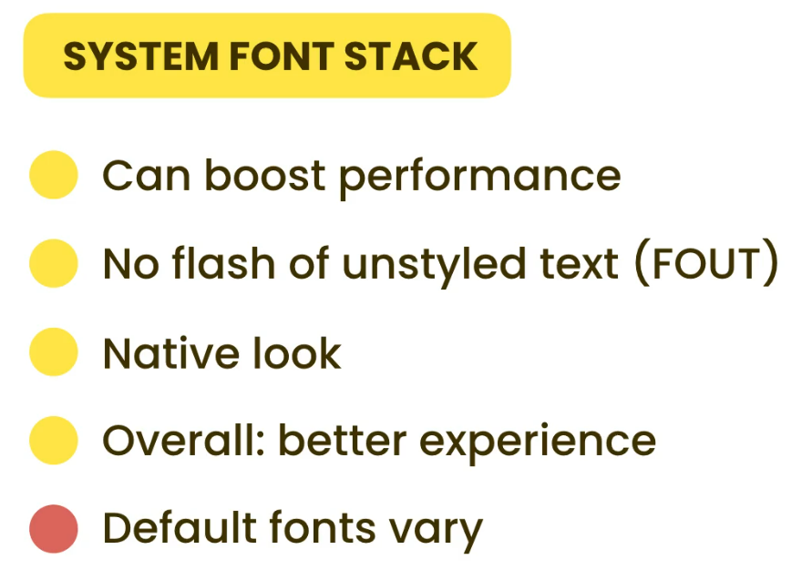
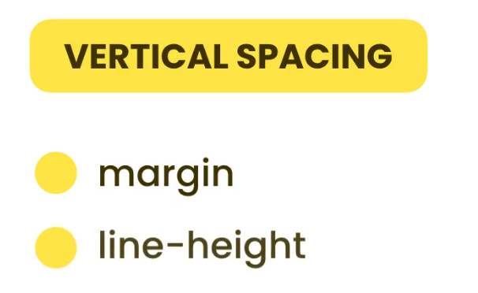
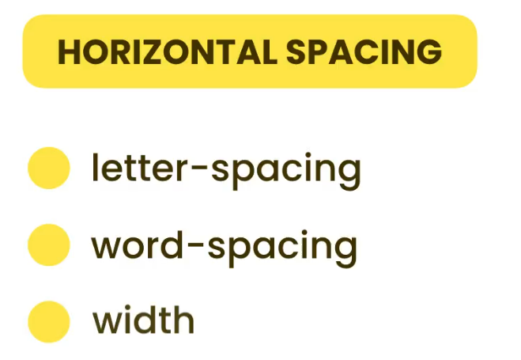

# Styling Fonts

There are mainly three types of fonts used in web design:

1. Serif Fonts – These fonts have small decorative lines (serifs) at the ends of characters. ( Examples: Georgia, Times New Roman, Times )

2. Sans Serif Fonts – These fonts do not have serifs, giving a clean and modern look.( Examples: Avenir, Arial, Futura, Helvetica, Roboto )

3. Monospace Fonts – In these fonts, every character takes up the same amount of horizontal space, making them ideal for displaying code. - ( Examples: Consolas, Courier New, Ubuntu Mono )

### Basic Font Styles in CSS

```css
body {
  font-family: Georgia, "Times New Roman", Times, serif; /* Font stack */
}

p {
  font-weight: normal; /* Options: normal, bold, or numeric values like 100–900 */
  font-style: normal; /* Options: normal, italic, oblique */
  font-size: 16px;
  color: #333;
}
```

- The `font stack` in `font-family` ensures that if the first font isn't available, the next one is used.

- Fonts like Georgia, Times New Roman, and Arial are known as **web-safe fonts** because they are commonly available on most devices and operating systems.

- Using a font stack improves compatibility and ensures better fallback behavior across browsers.

# Embedding Web Fonts

You can find web fonts on websites like `fontsquirrel.com, fonts.com, and myfonts.com`.

There are different types of font files such as `TTF, OTF, EOT, WOFF, and WOFF2`. For **web use**, we mainly use **WOFF and WOFF2** because they are smaller in size and load faster, making websites more efficient.

f you download a font in `TTF or OTF` format, you should convert it to `WOFF or WOFF2` using online tools like the Font Squirrel Webfont Generator.

To use the font on your website, you need to register it in your CSS file using **`@font-face`** at the top.

# Flash of Unstyled Text

When we use custom fonts on a website, the browser needs to download the font before it can be displayed. This download takes some time, and during that time, different browsers behave differently:

- Some browsers show a fallback font temporarily (this is called a Flash of Unstyled Text or **FOUT**).
- Others hide the text until the font is ready (this is called a Flash of Invisible Text or **FOIT**).

Unfortunately, we can’t completely avoid this issue, but we can reduce it using the CSS property `font-display`.

- `font-display:fallback` - The browser shows fallback text immediately. When the custom font finishes loading, it replaces the fallback text. This is a good balance between speed and design.

- `font-display:optional` - Similar to fallback, but if the font doesn’t load quickly, the browser** may skip using the custom font altogether** to improve performance (especially on slow connections) at first reload. On the second reload and afterward, the browser usually shows the custom font immediately,

# Font Services

Font Services

- Google Web Fonts (fonts.google.com)
- Adobe Fonts (fonts.adobe.com)
- fonts.com
- fontdeck.com

When we use font services like Google Fonts or Adobe Fonts, the `@font-face` rule is **automatically provided** by them. You don’t need to manually write or register the font using `@font-face`—they generate and include it for you through a link or script.

# System Font Stack

With a system font stack, we can tell the browser to use the fonts that are already installed in the user's operating system. This makes websites load faster and ensures consistent performance across different devices.



### Difference Between System Fonts and Web-Safe Fonts

- Web-safe fonts are basic fonts like Arial, Times New Roman, and Courier New. They have been around for over 20 years and are available on almost every computer.
- System fonts, on the other hand, are modern fonts used by today’s operating systems (like San Francisco on macOS or Segoe UI on Windows). These fonts look cleaner and more modern, and using them gives your website a more native feel on each platform.

```css
body{
    font-family:  system-ui, -apple-system, BlinkMacSystemFont, "Segoe UI", Roboto,
    Oxygen, Ubuntu, Cantarell, "Open Sans", "Helvetica Neue", sans-serif;"
}
```

# Sizing Fonts

Using pixels (px) for font sizes is not the best practice for modern web design. This is because pixels are not consistent across all devices. For example, Apple devices like Macs often use high-resolution screens (like Retina displays), which can fit more pixels into the same space. This makes everything look sharper and crisper, but it also means that fonts sized in pixels can appear smaller than expected.So, if you set a font to 20px on a Windows PC, it might look perfectly readable. But the same 20px on a Mac might appear smaller, which affects readability.

This is why pixels are not a reliable unit for consistent font sizing across different devices.

Instead of `px`, it's better to use `rem (root em)` units. `rem` scales based on the `html` element’s font size, and it adapts better to different screen sizes and device resolutions.

```css
html {
  /* % 16px x 62.5% = 10px - for easy calculations  */
  font-size: 62.5%;
}

p {
  font-size: 1.5rem;
}
```

By using relative units like `rem` , we can make our design more responsive with less code. (You can see this in action in index1.html and style1.css.)

A common best practice is to set the font-size **relative to the** `<html>` **element**. This way, all other text sizes using `rem` will scale consistently across different screen sizes, making the layout much easier to manage responsively.

### How big should the headings be ?

Visit **`type-scale.com`** and explore the different font size options. You can compare which sizes work best for each heading level and define clear rules for each text type.

```css
html {
  font-size: 62.5%;
}

h1,
h2,
h3,
h4,
h5,
h6 {
  font-family: "opensans";
}

p {
  font-family: "roboto";
}

/* NOTE: Font sizes below are for demonstration purposes only — not actual recommended sizes */
h1 {
  font-size: "4.12rem";
}

h2 {
  font-size: "3.42rem";
}

h3 {
  font-size: "2.98rem";
}

h4 {
  font-size: "2.42rem";
}

p {
  font-size: "1rem";
}
```

# Vertical Spacing



For `margins`, it's best practice to use `rem` **units**. This keeps spacing consistent and scalable across different screen sizes.

For `line-height`, we usually use `unitless values` (like 1.5 or 1.6). This makes the line height relative to the font size. So, if the font size changes, the line height will adjust automatically.

You can see this approach in action in the index1.html and style1.css files.

# Horizontal Spacing



For **horizontal spacing** like `letter-spacing` and `word-spacing`, we prefer using **pixels** (`px`) instead of `rem`.
This is because they require fixed, precise control, and even small changes (like 0.5px or 1px) can make a big difference in how the text looks and reads.

For paragraph `width`, the ideal line length for comfortable reading is about 50–70 characters per line. You can achieve this by setting the width to something like _width: 50ch_. The ch unit is based on the width of the "0" (zero) character, so 50ch usually fits around 62–70 actual characters, depending on the font (since some characters, like "i", are narrower). You don’t need to use this property everywhere, It is only a useful technique to improve readability in longer text blocks.

# Formatting Text

- `text-align` – Controls horizontal alignment of text. Options: left, right, center, justify
- `text-indent` – Adds indentation to the first line of a paragraph.
- `text-decoration` – Adds styles like underline, line-through, etc.
- `text-transform` – Controls text case: lowercase uppercase ,capitalize

`white-space` – Controls text wrapping and spacing behavior. (`nowrap` prevents text from wrapping to the next line.)

To truncate a single line of text with ellipsis (...), you need three properties:

```css
p {
  overflow: hidden;
  white-space: nowrap;
  text-overflow: ellipsis;
}
```

For multi-line truncation, you can use the modern CSS property: `line-clamp`

To display text in **multiple columns** (like in magazines), use:

- `column-count` – Number of columns
- `column-gap` – Space between columns
- `column-rule` – Line between columns (optional)

`direction` – Used for setting the direction of text, especially for right-to-left languages (like Arabic or Hebrew).
