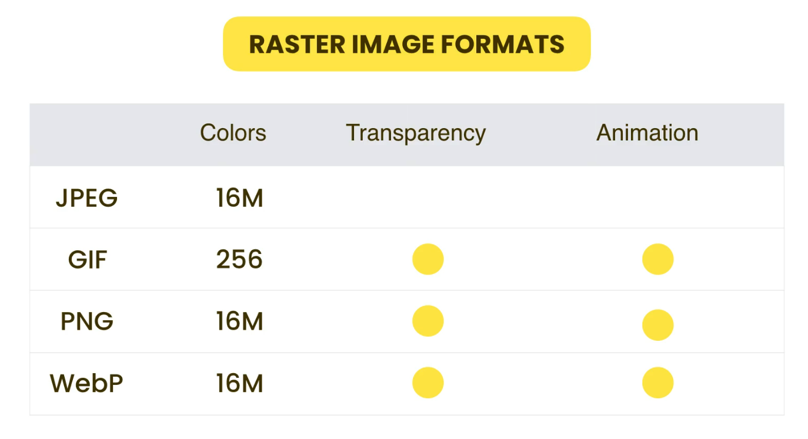
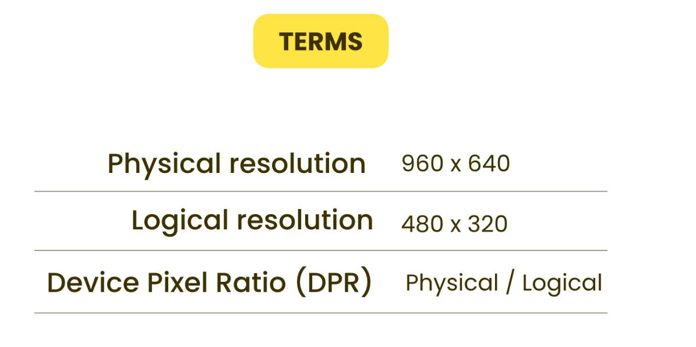
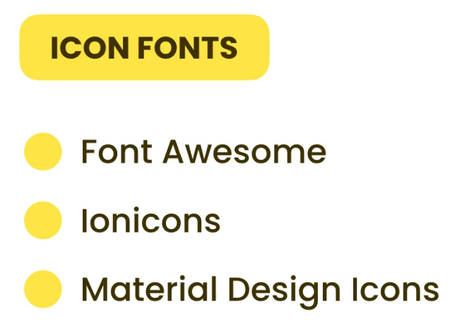

# Image Types and Formats

There are two main types of images.

#### 1. Raster Images

- Definition: Made up of pixels (tiny squares of color).

- Use Case: Ideal for photographs and complex images.

- File Formats: Common formats include JPEG (JPG), PNG, and GIF.

- Source: Usually come from cameras or scanners.

- Considerations -

  - Larger images mean more pixels, which increases file size.

  - In web design, large file sizes can slow down page load times.

  - Small raster images look blurry or pixelated when scaled up.

#### 2. Vector Images

- Definition: Made up of mathematical shapes like lines and curves.

- Use Case: Best for simple graphics, icons, and logos.

- File Format: SVG (Scalable Vector Graphics) is commonly used.

- Created With: Software like Adobe Illustrator.

- Advantages:

  - Scalable to any size without losing quality.

  - Always appear sharp, no matter the resolution or zoom level.

#### Summary:

- Use **raster images** for detailed photos, but optimize size for web performance.

- Use **vector images** for logos and icons, especially when scalability and sharpness are important.



# Content and Background Images

There Are Two Types of Images

1. Content Images
2. Background Images

### 1. Content Images

Use the HTML `` tag .Content images can serve two purposes:

#### A. Informative Purpose:

If the image adds meaning to the content (like a photo, chart, or diagram),

→ Provide a clear and descriptive alt text using the alt attribute.

```html

```

#### B. Decorative Purpose:

If the image is used only for decoration and does not convey important information,

→ Use an empty alt attribute like this: `alt=""`.

This tells screen readers to ignore the image.

**Note** : Never completely remove the alt attribute. If it’s missing, screen readers may try to read the file name, which can be confusing.

### 2. Background Images

Mostly used for `<body>` or `<div>` elements. Controlled through CSS background properties.

- `background` or `background-image`- You can use either `background: url('image.jpg')` or `background-image: url('image.jpg')` to set a background image.

- `background-repeat`- Use `background-repeat: no-repeat`; to prevent the image from repeating.

- `background-position` - ` background-position: 100px top`; This positions the image 100 pixels from the left and aligned to the top.

- `background-size`- Use `background-size: 100% 100%`; to stretch the image to fully cover the element’s width and height.
  ( If the container has no height by default (e.g., a <div> with no content), you may need to set a height, such as:
  height: 100vh )

- `background-attachment`- Use `background-attachment: fixed`; to make the background stay in place relative to the viewport when scrolling

# CSS Sprites

CSS Sprites are a technique used to optimize image loading on websites. Normally, when we use multiple images, the browser sends a separate request for each image. This can slow down the page, especially when many small images like icons or logos are used.

With CSS sprites, we combine multiple small images into a single image file. This way, the browser sends only one request to load all the images, which improves performance and reduces server load.

There are online tools called **CSS Sprite Generators** that can help you create sprite images and generate the required CSS.

However, there are two main drawbacks to using CSS sprites:

1. **File size can become too large** if you include too many images—especially unused ones. This reduces performance instead of improving it. So, you should only include essential and frequently used images like icons or logos.

2. **Flexibility is low.** If you want to replace or update a single image, you must recreate the entire sprite image and update the CSS, which can be inconvenient and time-consuming.

Because of these limitations, **you should use CSS sprites only when necessary**, especially when you need to reduce HTTP requests for small, repeated images.

# Data URL

Data URIs are another method used to optimize image requests. A Data URI converts an image into a base64-encoded string, which is then embedded directly into the HTML or CSS file.

Because the image data is included directly in the markup, the browser doesn’t need to make a separate HTTP request to load the image—it’s already there. This can reduce the number of server requests and slightly speed up loading in very specific cases.

However, there are several important drawbacks:

1. Larger File Size - Data URIs are typically larger than the original image file because base64 encoding adds overhead.

2. Increased Code Complexity - Embedding images as long strings inside HTML or Markdown makes the code harder to read and maintain. A single image can turn into a long, unreadable line in the markup.

3. Poor Mobile Performance - Data URIs can load slower on mobile devices due to increased processing time and memory usage.

Because of these disadvantages, the benefits of Data URIs are often outweighed by their downsides. Therefore, it’s best to **avoid using Data URIs whenever possible**, especially for larger or numerous images.

# Clipping

We can clip our images into any shape using an online clipping generators.

# Filters

We can apply filters such as _grayscale_, _blur_ and many more to images using the `filter` CSS property.

These filters can also be applied to other elements and can be triggered using effects like _hover_ for interactive styling.

# Supporting Hign Density Devices

### History -:

iPhone 3 was 480 × 320 px, but for the same display size, iPhone 4 was 960 × 640 px.
This was the first generation of high-density displays, which Apple called the Retina Display.

These are called **high-density displays**, so we might think that when displaying the same image on iPhone 4 and iPhone 3, it will take half the size of the screen (because iPhone 4 was 2× as iPhone 3, so it will only show half).

But this is false. There is something called a **scale factor**, so iPhone 4 will resize the image and show it at the same visual size.

### Terms -:



- **Physical resolution** – Based on the actual number of pixels in the device

- **Logical resolution** – How the device behaves

CSS is always based on the **logical resolution.**

And iPhone devices have a **DPR (Device Pixel Ratio)** of 2.

A **high-density screen (Retina display)** is any display where **DPR > 1** (so we have more physical pixels than logical pixels).

### Usage -:

So we should provide **1x, 2x, and 3x** images to support high-density displays.

We can enable this multiple option using the `srcset` property in the `` tag.

See the Example in Index.html.

# Resolution Switching

We should display images properly across different devices (phones, tablets, desktops). If we use a fixed width for the image—like _400px_—on every device, then there's no issue, as the image will appear at the same size on all screens.

However, if we use relative units like _100vw_ (100% of the viewport width), we may run into problems. The browser then has to scale the same image to different sizes depending on the device, which can cause performance and quality issues. This is known as a **resolution switching** problem.

To solve this, we can provide the image in **three different sizes**, allowing the browser to choose the most appropriate one based on the device’s screen resolution and pixel ratio.

To do this, we can use the `srcset` attribute in the `` tag. Instead of using `1x, 2x, and 3x` for retina displays, we can specify the **actual width**(photoshop width) (400w, 800w, 1200w) of each image. The browser will then automatically select the best image to display based on Screen Resolution and pixel ratio of the device.

(Refer to index1.html and style1.css for implementation.)

### Summary -

- If you use 1x, 2x, 3x: browser chooses **based on pixel density only**.

- If you use widths (400w, 800w, etc.) + (with/without) sizes: browser chooses **based on layout width × pixel density**.

---

Sometimes, we want our images to behave responsively: Full width on mobile / Half width on tablets / One-third width on desktop

To achieve this, we should not use CSS media queries alone to control which image the browser downloads. If we only use media queries, the browser doesn’t know in advance how large the image will appear on the page — so it might download the wrong image size, wasting bandwidth or showing a blurry image.

Instead, we should use the `sizes` attribute in the  tag to tell the browser how wide the image will be at different screen widths. This allows the browser to make the correct decision about which image to download from the `srcset`.

(Refer to index2.html and style2.css for implementation.)

---

#### My Note

The `sizes` attribute can be confusing, so it's better to use CSS and media queries to control the layout of the image.
Then, use srcset to let the browser choose the best image to download based on the display size and resolution.

This way:

- `CSS handles(media queries)` how big the image looks on the screen.
- `srcset` handles which image file to load for best performance.

# Using Modern Image Formats


WebP is a modern image format developed by Google. One of its main advantages is that it provides smaller file sizes compared to traditional formats like JPG or PNG, while maintaining good image quality.

There are two main ways to use images on a website:

### 1. Using the `` tag (Standard Way)

```html

```

However, if a browser doesn't support WebP, the image may not display.

### 2. Using the <picture> Element (Preferred for Compatibility)

This method allows you to provide multiple image formats. The browser will use the first supported format it finds:

```html
<picture>
  <source srcset="image.webp" type="image/webp" />
  <source srcset="image.jpg" type="image/jpeg" />
  
</picture>
```

- If the browser supports WebP, it loads image.webp.
- If not, it falls back to image.jpg.
- The  tag acts as a fallback and is also important for screen readers and accessibility.

# Art Direction

Sometimes, we want to show **different versions of an image** —such as a zoomed-in or cropped version—depending on the device or screen size. This concept is called Art Direction.

To implement art direction, we can use the `<picture>` element along with media queries to display different images for different screen sizes.

(Refer to index.html for implementation.)

---

### Note :

We _`cannot apply styles`_ like width or height directly to the `<picture>` or `<source>` tags because:

- The `<picture>` tag is a container, not a visual element.

- The `<source>` tag is a non-visual element used only to specify image sources.

To apply styles (such as setting width or height), we must use the `` tag inside the `<picture>` element. The styles applied to `` will affect the image displayed—whether it's from a WebP, JPG, or any other format.

# Scalable Vector Graphics

- SVGs are created in software like Illustrator, and they stay super sharp at any size.

- We can use SVGs for logos, icons, and backgrounds.

- For _SVG backgrounds_, we can visit websites like _`SVGBackgrounds.com`_ to find and use them easily.

# Font Icons

Another way to display icons is by using font icons.


