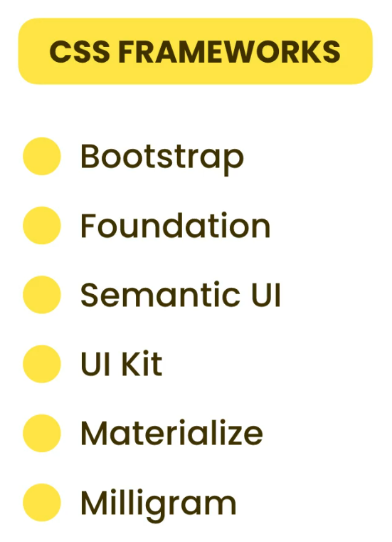

# CSS Frameworks

A framework is basically a collection of reusable CSS code that helps you build beautiful, modern-looking websites more easily.



**CDNs** (Content Delivery Networks) are a **network of servers** distributed around the world.

They are optimized to **quickly deliver web assets** like images, CSS files, JavaScript files, and more—helping websites load faster no matter where users are located.

---

**MyNote : Extra ORDER MATTERS** -

If we want to override the default Bootstrap styles, we can do it using custom CSS.

But an important thing to remember is:` We must add our custom CSS after we import Bootstrap`.

Otherwise, Bootstrap will override our styles. **`Order matters!`** The browser reads styles from top to bottom, so the last one wins.

Alternatives -

- More specific selectors
- Or add !important (only when necessary)

---

**MyNote : Extra - React CSS Overiding**

In React, we usually import Bootstrap in the main index.html file so that it’s available globally. On the other hand, we often import our custom CSS inside individual JSX component files.

However, the problem is that **React doesn’t guarantee a strict top-to-bottom global CSS load order across components**. Even if we import our custom CSS after Bootstrap, it may not always override Bootstrap styles as expected. This can make it difficult to manage CSS effectively, especially as the app grows.

Using **`more specific selectors`** or **`!important`** can sometimes help, but these are not reliable or scalable solutions. They can also lead to messy and hard-to-maintain code.

A _better approach_ is to **keep all CSS — including Bootstrap and custom styles — in one place, such as in the _index.js_ file**. This way, you can control the import order more precisely by importing Bootstrap first and then your custom styles after it.

An _even cleaner and more robust solution_ is to use **CSS Modules or Styled Components**. These techniques scope styles to specific components, which avoids conflicts and ensures your custom styles are applied correctly. They also help keep your code organized and easier to maintain in larger React projects.

In summary, instead of relying on override tricks, it’s better to either centralize your CSS imports or use scoped styling techniques like CSS Modules or Styled Components for a more predictable and maintainable styling approach in React.

---

**Milligram CSS** is easy to use for minimalist designs.

We only need to import the CDN, and the styles are automatically applied to basic HTML elements like buttons, inputs, and forms — no extra classes required.

# Text Fields

There are different types of input fields such as _text, number, password, date, email, button, checkbox_, etc.

- **value attribute:** Used to prepopulate the input field with a default value.

- **placeholder:** Text displayed inside the input field when it is empty, giving a hint to the user.

- **readonly:** The user can see the value but cannot change it.

- **disabled:** The field is disabled, meaning the user cannot interact with it or select its value. Also, its value will not be submitted to the server.

- **maxlength / minlength**: Used to set the maximum and minimum length for the input value, useful for validation.

- **autofocus**: A boolean attribute that automatically focuses the input field when the page loads, commonly used in login or registration forms.

### Textarea Attributes

The `<textarea>` element uses the attributes **rows** and **cols** to define its visible size.

It also supports other attributes like **disabled, readonly, and placeholder**.

However, to prepopulate a `<textarea>`, you must place the default text **between the opening and closing tags** of the `<textarea>` element (unlike `<input>`, which uses the value attribute).

---

## Important -:

In an `<input>` tag, the **`id`** attribute is used to bind the input field to a corresponding `<label>`. When the label’s **`for`** attribute _matches_ the input’s `id`, clicking on the label will automatically focus or trigger the input field.

The **name** attribute is used to identify the input when submitting form data to the server. Without a **name**, the input’s value will not be included in the form submission. ( `name` atrribute behaves as a key-value pair )

# Data Lists

A **datalist** is used to provide a list of predefined options for an `<input>` field, allowing users to either type their own value or select from the dropdown list.

#### Value Attribute in Datalist Options

Each `<option>` inside a datalist uses the `value` attribute to specify a unique value shown in the dropdown. However, the `value` itself is what appears to the user.

If you want to associate extra information with each option, you can create **custom data attributes** using the `data-` prefix in HTML, for example:

```html
<option value="Option1" data-newname="ExtraInfo1"></option>
```

---

Extra -->

By default, browsers apply their own native styles to datalists and options, so **custom CSS styles** on `<datalist>` and `<option>` **usually don’t work** and are overridden by browser defined styles.

Because of this limitation, if you want fully styled datalists functionality, you may need to use custom JavaScript solutions or third-party libraries.

# Drop down list

Dropdown lists are created using the `<select>` tag with multiple `<option>` elements.

- It's common to keep the **first option empty** to prompt the user to select a value (like “Select an option…”).

- The `selected` attribute is used to set a default selected option.

- The `multiple` attribute allows users to select more than one option. This also changes the appearance of the dropdown to show a list box instead of a single dropdown.

- The `<optgroup>` tag is used to group related options together under a category label, helping organize large lists.

# Check Boxes

Checkboxes are used when the user can select **one or more options** from a list.

- The `checked` attribute is used to make a checkbox selected by default.

- The `disabled` attribute makes the checkbox unclickable. It appears grayed out, and its value will not be submitted with the form.

# Radio Button

Radio buttons are used when the user can select **only one option** from a group.

- The `name` attribute is used to group radio buttons together. Only one radio button from the same group (same `name`) can be selected at a time.

- The `checked` attribute is used to make one of the radio buttons selected by default.

- The `disabled` attribute makes the radio button unclickable. It appears grayed out, and its value will not be submitted with the form.

# Sliders

Sliders are used to select a **numeric value within a range**. They are created using `<input type="range"`>.

- You can set the _minimum_ and _maximum_ values using the `min` and `max` attributes.

- Unfortunately, you cannot display the selected value directly using plain HTML and CSS alone. To show the value as the slider moves, you'll need to use JavaScript.

# File Inputs

File input fields allow users to **upload files** from their device. They are created using `<input type="file">`.

- The `multiple` attribute lets users select **more than one file** at a time.

- The `accept` attribute restricts the types of files users can choose. For example:

  - `accept=".jpg, .png"` allows only JPG and PNG files.

  - `accept="image/*"` allows any image format (e.g., JPG, PNG, SVG).

# Grouping releated Items

To group related form elements, you can use the `<fieldset>` tag. It creates a visual box around the grouped items.

- The `<legend>` tag is used inside the `<fieldset>` to provide a title or label for the group.

Some developers prefer using a `<section>` tag instead of `<fieldset>`, and use a heading tag like `<h2>` instead of `<legend>`, especially for layout or accessibility reasons.

# Hiddeen Fields

Hidden fields are created using `<input type="hidden">`.

They are used to **submit data that users don’t need to see or interact with**, but the **server still needs to receive**, such as:

- User ID
- Course ID
- Tracking or session values

🔒 Hidden fields are helpful for passing data **behind the scenes**, especially for things like form submissions or attendance tracking, where the user doesn't need to see the value, but the server still needs to read it.

⚠️ Warning: Never store sensitive information like passwords, tokens, or private data in hidden fields. Even though they aren’t visible on the page, **they can be easily seen in the browser’s developer tools or page source**.

# Data Validation

Before submitting data, we should always validate it. HTML5 provides built-in data validation, but if we need additional or custom validation, we should use JavaScript.

# Submitting the Form

To submit a form, we can use two types of buttons:

```html
<button type="submit">Submit</button> <button type="submit" value="submit" />
```

The first approach (`<button>Submit</button>`) is better because it allows more customization inside the button.

When submitting a form, two important attributes on the `<form>` tag are:

- `action`: Specifies the server URL where the form data will be sent.

- `method`: Specifies how the data is sent to the server.

  - If `method="POST"`, the form data is sent inside the **request body**.

  - If `method="GET"`, the form data is appended to the URL as **query parameters**.
