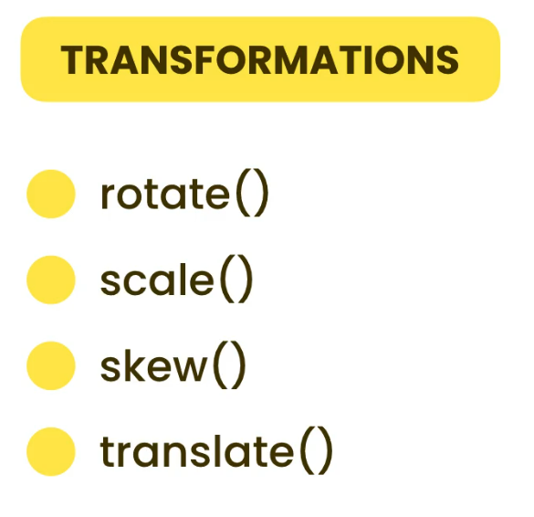

# Transformations

- **Rotate** – Rotates the element.

- **Scale** – Changes the size of the element (makes it bigger or smaller).

- **Skew** – Slants the element horizontally or vertically.

- **Translate** – Moves the element from one place to another.

# 3D Tranformation

#### What is perspective?

- Perspective is used in 3D transformations to create a sense of depth — it makes elements look like they're moving closer or farther away.

#### How to apply it?

You can apply perspective in two ways:

1. As a CSS property on a parent element – This affects all 3D-transformed child elements.

2. As a function (e.g., transform: perspective(500px)) directly on an element – This applies the perspective to that specific element.

(see the examples in style1.css , style2.css and style3.css)

# Transitions

Transitions allow us to **animate changes** between two states (e.g., when hovering or clicking an element).

Important note:

- We apply transitions to the **element itself**, not to the **final state**.

- This means the transition is defined on the original object, and it animates when a CSS property changes (like color, size, position, etc.).

# Animations

- The `transition` property is suitable for **simple animations**, like hover effects or state changes.

- For **more complex animations** (e.g., multiple steps, keyframes, looping), we should use the `animation` property instead.

#### Extra - Tip

The `animation` property is a **shorthand** that lets you define all animation settings (like name, duration, timing, etc.) _without writing each one separately_.

# Reusable Animations

We can create a **separate CSS class** that contains animation properties. Then, we can reuse this class by applying it to any element that needs the same animation.

This approach makes our code cleaner, faster to write, and more maintainable. ( See index1.html & style1.css)

We can use cool and ready-made animations from external libraries like Animate.css. ( See index2.html )
