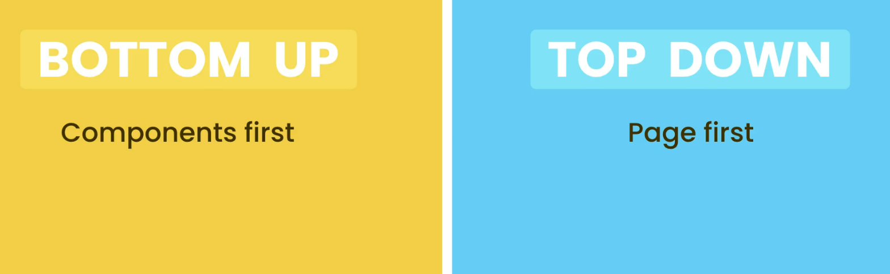

# Tools You need

- HTML CSS Support – This extension provides CSS class suggestions and IntelliSense directly in your HTML files.

- CSS Peek – Quickly jump to CSS definitions by Ctrl+Clicking class names in your HTML.

- Prettier – Automatically formats your code for consistent style across your project.

- Highlight Matching Tag – Highlights corresponding opening and closing HTML tags for easier readability.

- ToDo Highlight – Highlights TODO and FIXME comments to help you track pending tasks in your code

# Tips

Since mobile screens are small, we use larger fonts for body text and links to improve readability.

---

In the bottom-up approach, we design each component or element in isolation and then combine them to build the complete pages.

In contrast, the top-down approach starts at the page level, where we build the entire layout first and then work on individual elements. This can often lead to layout issues that are harder to debug and may become time-consuming to fix.

---
