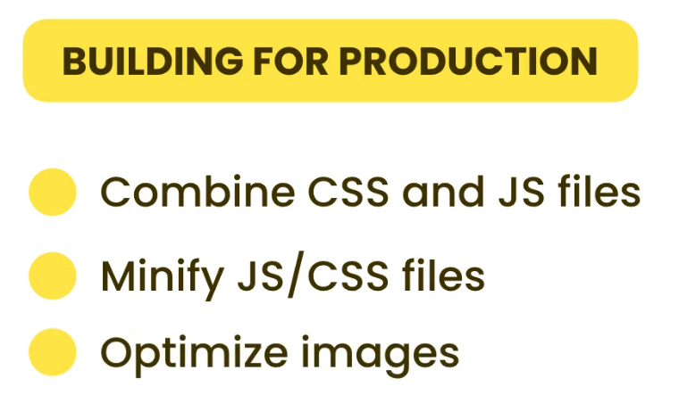
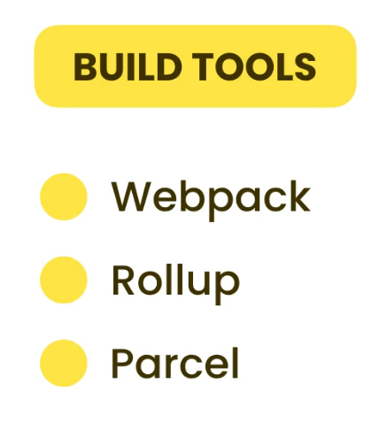

# Tools You need

- HTML CSS Support – This extension provides CSS class suggestions and IntelliSense directly in your HTML files.

- CSS Peek – Quickly jump to CSS definitions by Ctrl+Clicking class names in your HTML.

- Prettier – Automatically formats your code for consistent style across your project.

- Highlight Matching Tag – Highlights corresponding opening and closing HTML tags for easier readability.

- ToDo Highlight – Highlights TODO and FIXME comments to help you track pending tasks in your code

# Tips

Since mobile screens are small, we use larger fonts for body text and links to improve readability.

---

In the bottom-up approach, we design each component or element in isolation and then combine them to build the complete pages.

In contrast, the top-down approach starts at the page level, where we build the entire layout first and then work on individual elements. This can often lead to layout issues that are harder to debug and may become time-consuming to fix.

---

In a Grid layout with two columns, let's say the second grid (column) contains a button. By default, the button — like other grid items — stretches to fit its content if no height or width is specified.

We can use `justify-items` and `align-items` on the grid container to make **all items** (including the button) align in a certain way, such as centering them within their grid cells(Now the items will only take their width and height).

However, if we want to target only the button in the second grid column, we can use **`justify-self: center`** and **`align-self: center`** on that button. (Now, the element in that grid cell will only take up as much width and height as its content requires.).

---

If _height: 100vh_ is set, the element will take up the entire height of the viewport.

However, if you use **max-height: 100vh** and the parent has a fixed height with overflow: hidden, then the child element will only be able to take the parent's height, not the full 100vh. Any extra height will be clipped and not visible.

---

**`grid-template-columns: repeat(auto-fit, minmax(150px, 1fr));`**

This creates columns automatically based on the number of elements in the grid. Each column will be at least 150px wide, but can grow to take up as much space as available (up to a fraction of the total row width).
The number of columns will adjust based on the container’s width — more columns will fit on wider screens, fewer on smaller screens.

---

**`vertical-align`** is mainly used to align inline or inline-block elements vertically relative to the surrounding text or inline elements. It's commonly used in situations like aligning an icon or image with text.(Note: vertical-align does not work on block-level elements like `
` unless they are turned into inline or inline-block.)

---

# Building for Production

